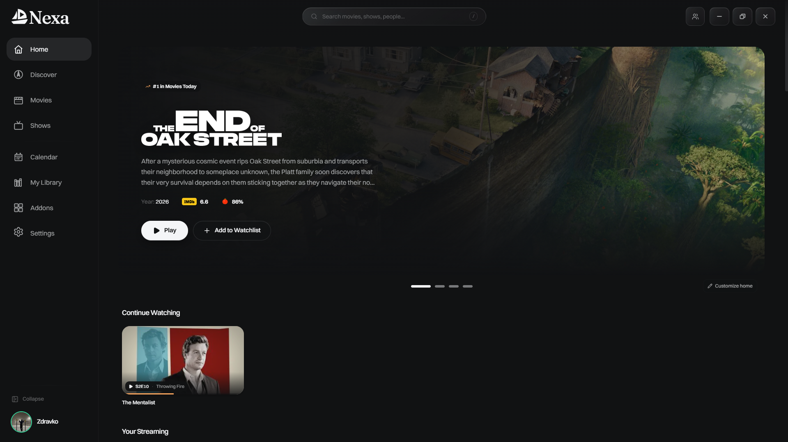

<div align="center">
<a name="readme-top"></a>

# Nexa

### A modern desktop entertainment client built around the open Stremio addon ecosystem.

Native playback, intelligent stream ranking, addons, debrid support, watch tracking, rich metadata, casting, profiles, themes, and a desktop-first UI — without requiring a Stremio account.

<br/>

[](#install)
[](./LICENSE)
[](https://v2.tauri.app/)
[](https://react.dev/)
[](https://www.rust-lang.org/)

<br/>

[Overview](#overview) · [Features](#features) · [Addons](#addons) · [Playback](#playback) · [Install](#install) · [Build](#build-from-source) · [Privacy](#privacy) · [Contributing](#contributing)

<br/>



<sub>Nexa home — cinematic hero, Continue Watching, personalized rails, and a desktop-first navigation layout.</sub>

</div>

---

> [!IMPORTANT]
> **Nexa does not provide, host, index, or bundle media.** It is a media client that can talk to the open Stremio addon protocol and to services you choose to configure. You are responsible for the addons, accounts, sources, and services you use.

> [!NOTE]
> Nexa is an independent open-source project. It is not affiliated with or endorsed by Stremio Ltd. A **Stremio account is not required**: Nexa speaks the addon protocol directly and manages its own local/cloud profile experience.

## Overview

Nexa is a desktop media client built with **Tauri 2, React, TypeScript, and Rust**.

The project started from Harbor, but Nexa is now being shaped around a simpler desktop experience: browse movies and shows, install and configure addons, rank streams intelligently, play through a native player, sync your own profile data, and customize the UI without needing to use Stremio's account system.

The current interface is organized around:

- **Home**
- **Discover**
- **Movies**
- **Shows**
- **Calendar**
- **My Library**
- **Addons**
- **Settings**

The old Live TV room is no longer part of the main Nexa experience, and TV/Android work is being treated separately from this desktop client.

## Features

<table>
<tr>
<td width="50%" valign="top">

### 🎬 Browse & discover

- Cinematic rotating home hero
- Continue Watching
- Movie and series discovery views
- Calendar and library views
- Metadata enrichment through optional providers
- Personalized and service-oriented rails where configured

</td>
<td width="50%" valign="top">

### ▶ Native playback

- Native **libmpv** desktop player
- HTML5/WebView fallback where appropriate
- HDR and subtitle support
- Skip intro/outro integrations
- Picture in Picture
- A/B loop and sleep timer
- Trickplay seek previews
- Stream switching inside the player

</td>
</tr>
<tr>
<td width="50%" valign="top">

### 🧩 Addons

- Browse community addons
- Install by manifest URL
- Configure supported addons inside Nexa
- Recommended addon bundles
- Manage installed addons
- Support for `stremio://` links and legacy compatibility links

</td>
<td width="50%" valign="top">

### ⚡ Stream engine

- Parallel addon querying
- Resolution / HDR / codec / audio parsing
- Trust filtering
- Quality scoring and ranking
- Debrid-aware cache prioritization
- Manual source selection when automatic playback cannot resolve a suitable source

</td>
</tr>
<tr>
<td width="50%" valign="top">

### ☁ Profiles & sync

- Nexa accounts powered by Supabase
- Primary profile on first account creation
- Optional additional user-created profiles
- Watchlist, history, Continue Watching, settings, and other profile data
- Update-safe local data and settings

</td>
<td width="50%" valign="top">

### 🎨 Customization

- Multiple themes and layouts
- Custom fonts
- Theme Studio / visual editing
- Player layout customization
- D-pad / keyboard spatial navigation
- Per-view scroll memory
- Dark desktop-first design

</td>
</tr>
</table>

## Addons

Nexa uses the **open Stremio addon protocol**, but it does **not** require a Stremio account connection.

Installed addons can provide catalogs, metadata, streams, and subtitles. Nexa's Addons section supports browsing, installing, configuring, and managing addons directly from the desktop client.

### Recommended bundle

Nexa can offer a simple recommended starter bundle built around:

- **Cinemeta**
- **OpenSubtitles**
- **Torrentio**

You can still install or remove addons individually and configure them yourself.

> [!TIP]
> Nexa does not ship third-party addon content itself. Addons remain separate services with their own behavior and terms.

## Playback

When you press **Play**, Nexa gathers available sources from installed addons and runs them through its ranking pipeline.

```text
parse → trust → score → rank
```

The ranking system can consider signals such as:

- resolution
- HDR format
- video/audio codec
- file size
- seeders
- release group
- language
- source/container type
- debrid cache state
- title / year / season / episode matching

Confirmed cached debrid sources can be prioritized for instant playback. If the selected torrent is unavailable or uncached, Nexa can stop the automatic cascade and present the stream selector so the user stays in control.

### Debrid support

Nexa supports integrations for services such as:

- Real-Debrid
- AllDebrid
- Premiumize
- Debrid-Link
- TorBox

Debrid is optional. Availability and behavior depend on the addon/service combination you configure.

## Metadata & tracking

Optional integrations can enrich Nexa with ratings, artwork, watch tracking, and discovery data.

Examples currently represented in the project include:

- TMDB
- OMDB
- Fanart.tv
- RPDB
- MDBList
- Trakt
- Simkl
- Letterboxd
- Kitsu / AniZip

API keys and service credentials are managed from Nexa's simplified **API Keys** / connected-services settings rather than being scattered throughout the app.

## Casting

The desktop client contains local-network casting support, including work for:

- Chromecast / CASTV2
- DLNA / UPnP
- AirPlay
- Roku

Device support can vary by model, protocol implementation, and source format.

## Updates

Nexa uses the **Tauri v2 updater** with signed GitHub Releases.

When a newer stable release is available:

1. Nexa detects the new release.
2. The app shows its update UI.
3. The user can choose to update or do it later.
4. The downloaded update is signature-verified.
5. Nexa installs it and relaunches.

Updates are not intended to be silently forced on users.

## Privacy

Nexa is designed so that credentials and local configuration stay under the user's control.

- API keys are not committed into the repository.
- Release builds receive required public client configuration through GitHub Actions secrets.
- Nexa does not require a Stremio account.
- Addon and debrid credentials are only used for the services you explicitly configure.
- The app's profile/cloud layer is separate from Stremio account infrastructure.

Always review the privacy policies of third-party addons and services you connect.

## Install

### Windows

Download the latest Windows installer from the repository's **Releases** page.

Nexa currently focuses its official release workflow on Windows. The NSIS installer is produced by GitHub Actions and participates in the signed Tauri updater flow.

Because Nexa is an independent open-source project and may not use a commercial Windows code-signing certificate, Windows SmartScreen may display an **Unknown publisher** warning.

### Upgrading from Harbor

The Nexa rebrand preserves compatibility-sensitive Harbor identifiers where required so that existing users can upgrade without losing app data.

The 0.9.26 migration is intended to preserve:

- login session
- profiles
- settings
- API keys
- watch history
- library data
- addons
- local app data

Internal legacy identifiers may therefore still contain the name `harbor`. This is intentional and should not be treated as incomplete rebranding.

## Configuration

Most optional services are configured from **Settings**.

| Area                    | Examples                                              |
| ----------------------- | ----------------------------------------------------- |
| **API Keys**            | TMDB, OMDB, Fanart.tv, RPDB, MDBList, debrid services |
| **Watch Tracking**      | Trakt, Simkl, Letterboxd                              |
| **Streaming / Network** | stream filtering, relay, P2P/server options           |
| **Player**              | engine, subtitles, hotkeys, player layout             |
| **Appearance**          | theme, fonts, layout, UI scaling                      |
| **Account**             | Nexa account and profiles                             |

## Build from source

Nexa is a **Tauri 2** application with a React/TypeScript frontend and Rust backend.

### Prerequisites

- [Node.js](https://nodejs.org/)
- [pnpm](https://pnpm.io/)
- [Rust](https://rustup.rs/)
- [Tauri 2 prerequisites](https://v2.tauri.app/start/prerequisites/)

Clone the repository, then:

```bash
pnpm install
pnpm run setup
pnpm tauri dev
```

For a production build:

```bash
pnpm tauri build
```

> [!NOTE]
> `pnpm run setup` fetches native sidecars and other platform-specific assets that are intentionally not stored directly in the repository.

## Architecture

```text
┌──────────────────────────────────────────────┐
│                 Nexa UI                      │
│        React · TypeScript · WebView2         │
└──────────────────────┬───────────────────────┘
                       │
              Tauri invoke / events
                       │
┌──────────────────────▼───────────────────────┐
│                Rust backend                  │
│ player · casting · torrent · settings · I/O  │
└──────────────┬───────────────────────┬───────┘
               │                       │
        native playback          external services
           libmpv             addons · metadata · debrid
```

Some internal module/crate names still use `harbor` for compatibility and historical reasons.

## Project direction

Nexa is intentionally being simplified around its strongest desktop use cases.

Recent direction includes:

- ✅ Harbor → Nexa rebrand
- ✅ Simplified Settings navigation
- ✅ GitHub-based signed updater
- ✅ Recommended addon bundles
- ✅ Improved stream fallback / manual switching behavior
- ✅ Stable Continue Watching ordering and watch-state improvements
- ✅ Removal of the old Live TV room from the main desktop experience
- ✅ Removal of the old Stremio account connection requirement
- 🚧 Games Hub / launcher work exists separately and is **not part of the current stable release**
- 🚧 TV / Android work is being treated as a separate project/client rather than bloating the desktop app

## Contributing

Contributions are welcome.

1. Fork the repository.
2. Create a feature branch.
3. Make your changes.
4. Run the relevant checks/build.
5. Open a pull request with a clear description and screenshots for UI changes.

For bugs, open a GitHub issue with reproduction steps and logs where possible.

Please do not include API keys, access tokens, private signing keys, `.env` files, or other secrets in issues or pull requests.

## Disclaimer

> [!IMPORTANT]
> Nexa is an independent open-source media client. It does not host, index, provide, or sell media. It does not ship third-party content addons. The user chooses which addons, sources, accounts, and services to configure and is responsible for complying with applicable laws and third-party terms.

Nexa is not affiliated with, endorsed by, or associated with Stremio Ltd.

## Acknowledgements

Nexa builds on an open ecosystem and many excellent projects, including:

- Harbor, the original MIT-licensed project this fork evolved from
- Stremio's open addon protocol and addon ecosystem
- Tauri
- React
- Rust
- Vite
- Tailwind CSS
- libmpv
- Cinemeta
- TMDB
- OMDB
- Fanart.tv
- RPDB
- Kitsu / AniZip
- OpenSubtitles
- the wider addon and open-source community

## License

Nexa is distributed under the **MIT License**.

See [`LICENSE`](./LICENSE) for the complete license text and retained copyright notices.

---

<div align="center">

**Nexa**

_Movies. Shows. Your setup._

<br/>

<sub>Built as an open desktop client for people who want more control over their media experience.</sub>

<br/><br/>

<a href="#readme-top">▲ Back to top</a>

</div>
